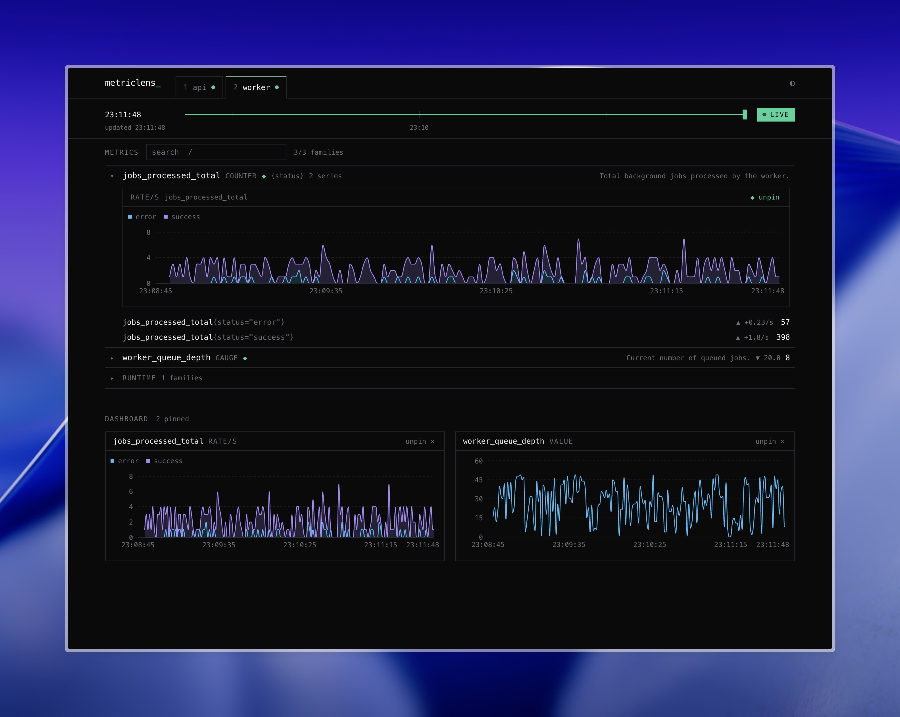

# metriclens

**Local Prometheus DevTools for Docker Compose.**

See your services' Prometheus metrics while you develop — live charts and instrumentation warnings, without setting up Prometheus or Grafana.



## Try it

The [example project](example/basic) runs metriclens alongside two instrumented services generating live traffic:

```bash
git clone https://github.com/tyshkovskii/metriclens.git
cd metriclens/example/basic
docker compose up --build
```

Open <http://localhost:9999>. You'll see both services discovered and scraped, with:

- **Raw metrics** — every metric with its help text, type, and labels, updated live.
- **Panels** — charts built automatically from metric types: rates for counters, current values for gauges, latency percentiles for histograms.
- **Quality warnings** — missing `HELP` or `TYPE`, counters not named `*_total`, labels that look high-cardinality.

## Use it in your project

Add one service to your existing `docker-compose.yml`:

```yaml
services:
  metriclens:
    image: tyshkovskii/metriclens:0.1
    ports:
      - "9999:9999"
    volumes:
      - /var/run/docker.sock:/var/run/docker.sock:ro
```

metriclens finds the other services in your Compose project on its own, locates their metrics endpoints (it tries common ports and paths like `/metrics`), and starts scraping.

## Configuration

Usually none is needed. If metriclens can't find a service's metrics endpoint, point it at the right port with a label:

```yaml
services:
  api:
    labels:
      metriclens.port: "8080"
      metriclens.path: "/metrics"
```

To hide a service from metriclens, label it `metriclens.exclude: "true"`.

On the metriclens container itself you can tune two environment variables: `metriclens_SCRAPE_INTERVAL` (default `5s`) and `metriclens_RETENTION` (default `15m`, metrics are kept in memory only).

## License

[MIT](LICENSE)
