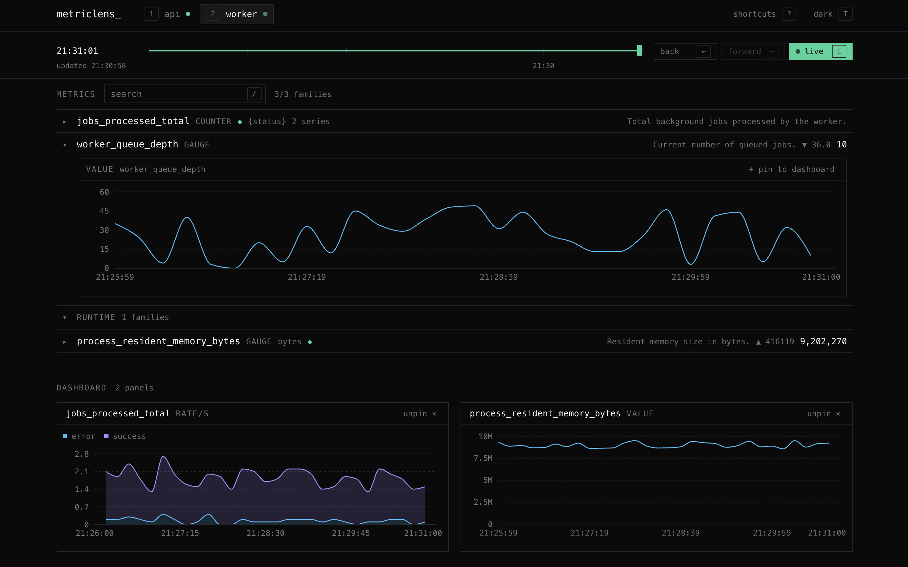

# metriclens [](https://hub.docker.com/r/tyshkovskii/metriclens/tags) [](https://hub.docker.com/r/tyshkovskii/metriclens)

metriclens is a zero-config, drop-in observability layer for Compose-based development environments, automatically discovering Prometheus metrics and surfacing live charts and instrumentation issues without requiring Prometheus or Grafana.

## Try it

The [basic example](example/basic) runs metriclens alongside two instrumented services generating live traffic:

```bash
git clone https://github.com/tyshkovskii/metriclens.git
cd metriclens/example/basic
docker compose up --build
```

Open <http://localhost:9999>. You'll see both services discovered and scraped, with:

- **Raw metrics** — every metric with its help text, type, and labels, updated live.
- **Panels** — charts built automatically from metric types: rates for counters, current values for gauges, latency percentiles for histograms.
- **Quality warnings** — missing `HELP` or `TYPE`, counters not named `*_total`, labels that look high-cardinality.

See the [example index](example) for additional projects showing application
client-library metrics, an exporter for an uninstrumented Redis service, and a
Pushgateway-backed batch job.

## Use it in your project

Published Docker images are available on [Docker Hub](https://hub.docker.com/r/tyshkovskii/metriclens).

Add one service to your existing `docker-compose.yml`:

```yaml
services:
  metriclens:
    image: tyshkovskii/metriclens:latest
    ports:
      - "127.0.0.1:9999:9999"
    volumes:
      - /var/run/docker.sock:/var/run/docker.sock:ro
```

metriclens finds the other services in your Compose project on its own, locates their metrics endpoints (it tries common ports and paths like `/metrics`), and starts scraping.

Pin a version from the [Docker Hub tags page](https://hub.docker.com/r/tyshkovskii/metriclens/tags) if you want repeatable environments.

## Agent and tool discovery

Four small discovery surfaces make MetricLens easy to use from development agents:

- [`/openapi.json`](http://localhost:9999/openapi.json) is the complete static OpenAPI contract.
- [`/llms.txt`](http://localhost:9999/llms.txt) is concise agent guidance and workflow context.
- [`/mcp`](http://localhost:9999/mcp) is the Streamable HTTP MCP endpoint with five bounded tools: `observe_stack`, `wait_for_stack`, `start_experiment`, `compare_experiment`, and `get_metric_evidence`.
- [`/api/capabilities`](http://localhost:9999/api/capabilities) is machine-readable runtime truth, including the active timing configuration, implemented features, limits, and links to the other discovery surfaces.

Use MCP for the wait → marker → workload → compare → evidence workflow, `llms.txt` for instructions, and `api/capabilities` for values that may differ between environments.
The `/llm` path is intentionally absent; `/llms.txt` is the standard discovery document.

## CLI workflow

The image also includes `metriclensctl`, a compact JSON CLI for agents. It uses `METRICLENS_URL` (or `http://localhost:9999` by default) and keeps normal output on stdout:

```bash
metriclensctl wait --services api,worker --timeout 60s
metriclensctl start --name checkout --client-run-id run-42
./run-integration-test.sh
metriclensctl compare --from marker-1 --severity warning,error
metriclensctl evidence --target api-1 --metric http_requests_total --max-points 100
```

For a reproducible local evaluation, let the CLI run the explicit workload child directly (without a shell):

```bash
metriclensctl evaluate --services api,worker \
  --expect scrape_error --expect quality_warning \
  --severity warning,error --settle 0 --min-f1 1.0 -- \
  go test ./...
```

Exit codes are `0` for success, `1` for usage, transport, API, or response errors, and `2` when an evaluation does not meet its workload or signal-F1 threshold. Evaluation reports `estimatedResponseTokens` as a bytes/4 approximation, not tokenizer output. Its precision, recall, and F1 compare unique returned finding signals against the signals supplied with `--expect`; a nonzero omitted-finding count also fails evaluation, so scores are not semantic model-accuracy claims. MetricLens still does not start Docker or run workloads; only the explicit local `evaluate` child command is executed by the CLI.

## Configuration

Usually none is needed. If metriclens can't find a service's metrics endpoint, point it at the right port with a label:

```yaml
services:
  api:
    labels:
      metriclens.port: "8080"
      metriclens.path: "/metrics"
```

To hide a service from metriclens, label it `metriclens.exclude: "true"`.

On the metriclens container itself you can tune two environment variables: `metriclens_SCRAPE_INTERVAL` (default `5s`) and `metriclens_RETENTION` (default `15m`, metrics are kept in memory only).

## License

[MIT](LICENSE)
